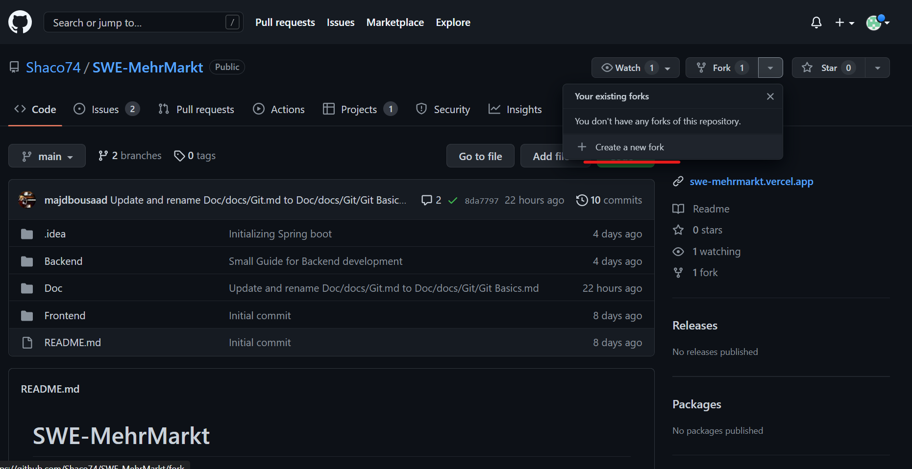
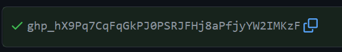

### Cloning the project:

#### Fork the repository:
1. visit <a href="https://github.com/Shaco74/SWE-MehrMarkt" target="_blank"> the repository</a>.
2. fork it:
 
 
3. uncheck *copy the main branch only*
   
   (this will create a copy of the project on your github account)
   

#### Clone the fork into your Intellij IDE:

1. Open your Intellij IDE:
 File / New / Project from Version Control
   
2. under GitHub click on use token
   
3. Now go to your GitHub account to get the token:
Click on your profile / settings / developer settings / Personal access token / Tokens(classic) / Generate new Token (classic).
**check all the felds and choose No Expiration**
4. Copy the resulted link back into your intellij IDE:
 

Now you'll see all your repositories. Choose your path below and clone it.
5. Sync the fork: under **Git/GitHub/Sync fork**

6. add your Feature Branch:
right click on upstream develop branch -> new Branch from upstream/develop

   

### Pull request

This is just an example of the future work
1. add a file hello.txt (make sure you're on Feature_Hello_World Branch)

2. Commit your changes. Commits are only local changes that will be pushed later into your repository
CTRL + k (Strg + k) 
 **adding hello.txt** is the commit message, it's so important for organizing commits, make sure it's understandable and efficient.
Then **_Commit and Push_**
3. Now when you open your GitHub repository, you'll find this:

This is the pull request, if you click on it, the request will be currently sent to us for checking and approval. 
